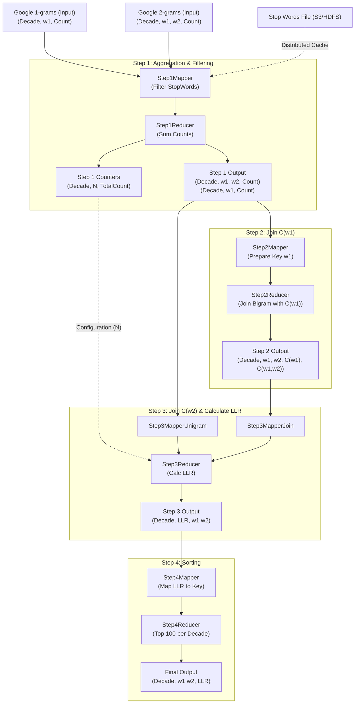

# Project Architecture: Collocation Extraction

This document outlines the architecture of the Collocation Extraction project, which utilizes a 4-step Hadoop MapReduce pipeline to identify significant bigram collocations from the Google N-grams dataset using Log Likelihood Ratio (LLR).

## High-Level Data Flow

## Detailed Component Logic

### Step 1: Aggregation & Filtering
*   **Purpose**: Clean raw data and count occurrences.
*   **Mapper (`Step1Mapper`)**:
    *   Reads 1-grams and 2-grams.
    *   Loads **Stop Words** from Distributed Cache.
    *   Filters out entries containing stop words.
    *   Directs output to Reducer or "Counters" file (for total N count).
*   **Reducer (`Step1Reducer`)**:
    *   Aggregates counts for each unigram and bigram per decade.
    *   Writes `<Decade, N, *, TotalCount>` to a side file ("counters") used later for LLR calculation.

### Step 2: Join C(w1)
*   **Purpose**: Associate the count of the first word (`w1`) with the bigram (`w1, w2`).
*   **Key Idea**: Use a composite key `<Decade, w1, OrderTag>`. `w1` comes before `w1, w2` so the reducer sees the unigram count first.
*   **Reducer (`Step2Reducer`)**:
    *   Receives `C(w1)` first.
    *   Attaches this count to all subsequent bigrams starting with `w1`.
    *   **Output**: `<Decade, w1, w2> \t <C(w1), C(w1, w2)>`

### Step 3: Join C(w2) & Calculate LLR
*   **Purpose**: Associate `C(w2)` and compute the final score.
*   **Algorithm**:
    *   Receives Unigram `w2` counts from **Step 1 Output**.
    *   Receives Bigrams (with `C(w1)` attached) from **Step 2 Output**.
    *   Joins on `w2`.
    *   Uses `N` (Total words in decade) passed via **Configuration** from Step 1's counter file.
    *   Calculates **Log Likelihood Ratio (LLR)** using `N`, `C(w1)`, `C(w2)`, and `C(w1, w2)`.
    *   **Output**: `<Decade> \t <LLR> \t <w1 w2>`

### Step 4: Sorting
*   **Purpose**: Rank top collocations.
*   **Logic**:
    *   Mapper uses `LLR Score` as the sort key (Descending).
    *   Reducer outputs only the top 100 results per decade.
    *   **Output**: `<Decade> \t <w1 w2> \t <LLR>`

## System Components
*   **Framework**: Apache Hadoop MapReduce (Java).
*   **Orchestration**: `Main.java` uses `JobControl` or sequential `waitForCompletion` to chain jobs.
*   **Optimization**:
    *   **Combiners** in Step 1 to reduce network traffic.
    *   **WritableComparable** custom keys for efficient secondary sorting.
